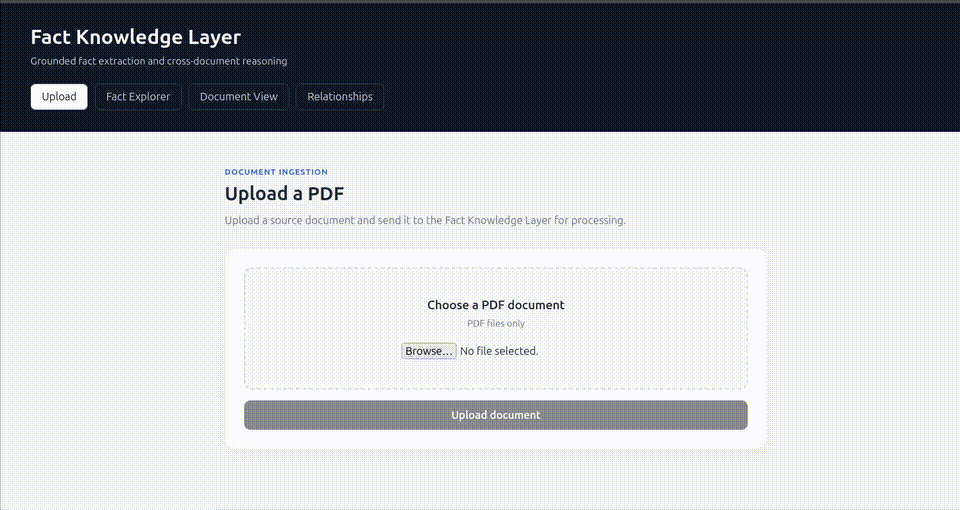

# Fact Knowledge Layer

## Setup and Run Instructions

### Prerequisites

Make sure the following are installed:

- Python 3.11+
- Node.js 18+
- Docker and Docker Compose
- Ollama

The project uses FastAPI, PostgreSQL with pgvector, Redis, Celery, React/Vite, and Ollama.

### 1. Clone the repository

```bash
git clone https://github.com/Harsh-128/fact-knowledge-layer-submission.git
cd fact-knowledge-layer-submission
```

### 2. Start PostgreSQL and Redis

From the project root:

```bash
docker compose up -d
```

Check the services:

```bash
docker compose ps
```

Make sure PostgreSQL and Redis are running before continuing.

### 3. Configure the backend

```bash
cd backend
cp .env.example .env
```

Update `.env` with your local configuration if required.
Do not commit `.env` or any credentials to the repository.

### 4. Create the Python environment

From the `backend` directory:

```bash
python -m venv .venv
source .venv/bin/activate
```

Install the backend dependencies:

```bash
pip install -r requirements.txt
```

### 5. Start Ollama

The project uses Ollama for local LLM inference.
Make sure Ollama is installed and pull the required model:

```bash
ollama pull qwen3:8b
```

Make sure Ollama is running before processing PDFs.

### 6. Start the FastAPI backend

From the `backend` directory:

```bash
uvicorn app.main:app --reload
```

The API will normally be available at:

```
http://localhost:8000
```

### 7. Start the Celery worker

Open another terminal:

```bash
cd ~/Projects/fact-knowledge-layer/backend
source .venv/bin/activate
```

Start the Celery worker:

```bash
celery -A app.workers.celery_app:celery_app worker --loglevel=info
```

The worker processes document ingestion, fact extraction, and fact comparison asynchronously.

### 8. Start the frontend

Open another terminal:

```bash
cd ~/Projects/fact-knowledge-layer/frontend
npm install
npm run dev
```

Open the URL shown by Vite, normally:

```
http://localhost:5173
```

---

## Video Demo

**Demo video:** https://youtu.be/CNV7ICs5Wns

The demo is under 3 minutes and shows the application processing a PDF through the UI.
### Demo Preview



The demonstration covers:

1. Uploading a PDF.
2. Background processing.
3. Extracted facts.
4. Source evidence and page references.
5. Fact exploration.
6. Cross-document relationship analysis.
7. Corroboration.
8. Contradiction.
9. Reconciliation by context.
10. An extraction limitation discovered during testing.

---

## Required Demo Cases

The system was evaluated against the four required reasoning and extraction cases.

### Case 1 — Corroborated Fact

**Scenario:**  
The same underlying fact appears across multiple documents, potentially using different wording, units, or presentation formats.

**Example:**  
The system identifies matching facts referring to the same entity and attribute across documents and creates a `CORROBORATES` relationship.

**System reasoning:**
- Resolve the extracted facts to the same entity.
- Compare the attribute and value.
- Consider units and temporal/contextual scope.
- If the values represent the same underlying fact, classify the relationship as `CORROBORATES`.

**Evidence shown:**  
Each fact retains its source document, page, chunk, and exact supporting text.

---

### Case 2 — Genuine Contradiction

**Scenario:**  
Two documents report different values for the same entity and attribute under the same relevant context.

**Example:**  
One source reports revenue as **INR 100 crore**, while another reports **INR 200 crore** for the same scope.

**System reasoning:**  
After entity and attribute matching, the comparison layer determines that the values cannot represent the same numerical fact and creates a `CONTRADICTS` relationship.

**Evidence shown:**  
Both conflicting facts retain their independent source evidence and page references.

---

### Case 3 — Apparent Contradiction Explained by Context

**Scenario:**  
Two values initially appear contradictory but become consistent after considering units, time period, or scope.

**Example:**  
A value of **INR 100 crore** and **INR 1000 million** represent the same amount after unit normalization.

**System reasoning:**
- Match the facts to the same entity and attribute.
- Compare numerical values after considering their units.
- Examine temporal and contextual scope.
- Determine that the apparent difference is explainable rather than a genuine contradiction.

The system therefore creates a `RECONCILES` relationship instead of marking the facts as contradictory.

**Evidence shown:**  
The relationship retains links to both source facts and their supporting evidence.

---

### Case 4 — Extraction / Reasoning Failure

**Scenario:**  
During testing with a previously unseen PDF, the extraction pipeline encountered a table whose numerical columns were not reliably associated with the corresponding rows.

**Observed issue:**  
The system was able to extract meaningful text values from the table, but the table structure was not sufficiently preserved to guarantee that each numerical value was mapped to the correct row/column.

**How it was handled:**  
The pipeline validates extracted evidence against the original chunk text and retains confidence and review metadata. However, this particular example was not automatically flagged for review, demonstrating a limitation in the current extraction approach.

**Planned improvement:**
- Add table-aware PDF parsing.
- Preserve row/column relationships explicitly.
- Validate numerical values against table headers.
- Add stronger confidence checks for ambiguous table extraction.
- Route uncertain table facts to `needs_review`.

  ---

## Approach

### 1. Architecture

The system is implemented as an asynchronous fact knowledge pipeline:

**PDF Upload → Document Ingestion → PDF Parsing & Chunking → LLM Fact Extraction → Evidence Validation → Entity Resolution → Fact Clustering → Fact Comparison → Relationship Persistence → API/UI**

The backend is built with **FastAPI**, with **Celery + Redis** used for background processing. **PostgreSQL + pgvector** is used for persistence and similarity-based operations. **Ollama** is used to run the local `qwen3:8b` model for fact extraction and comparison.

The frontend is implemented with React and provides views for:
- PDF upload and processing status.
- Extracted facts.
- Source evidence.
- Fact filtering and exploration.
- Cross-document relationships.

---

### 2. Fact Extraction

The PDF is first parsed into pages and chunks. The chunks are then sent to the LLM with instructions to extract meaningful facts rather than simply summarizing the document.

Facts are represented using a flexible structure containing information such as:
- Entity
- Attribute / fact type
- Value
- Unit
- Temporal scope
- Confidence
- Source evidence
- Review status

The fact representation uses JSON/JSONB-style structures so that the system is not tied to one fixed document schema.

This was important because the input PDFs can belong to different domains and can contain different types of facts.

---

### 3. Evidence Grounding

A major design requirement was that extracted facts must be traceable back to the source document.

The extraction prompt requires the model to return:
- Source page
- Source chunk
- Exact supporting quote
- Evidence confidence

The backend then validates the returned evidence against the actual chunk text.

The system only accepts evidence when the quoted text is actually present in the source chunk and the referenced page matches the source chunk. Character offsets are also calculated so that the frontend can highlight the relevant evidence.

If a fact cannot be grounded to valid source evidence, the extraction pipeline raises an extraction error instead of silently storing an unsupported fact.

This was chosen to reduce hallucinated facts and make every result auditable.

---

### 4. Entity Resolution

Facts extracted from different documents need to be associated with the same underlying entity before they can be compared.

The entity resolution layer attempts to map equivalent entity references to a common entity. This allows facts from different documents to participate in the same comparison group even when the documents use different wording.

The comparison process therefore operates on:

**Entity → Attribute → Facts**

rather than simply comparing arbitrary facts from different documents.

---

### 5. Fact Comparison and Relationships

After facts are grouped by entity and attribute, the comparison service determines the relationship between pairs of facts.

The system supports three important relationship types:

- `CORROBORATES` — facts support the same underlying information.
- `CONTRADICTS` — facts represent conflicting information.
- `RECONCILES` — values initially appear different but can be explained by context such as units, time periods, or scope.

The comparison considers numerical values, units, temporal scope, and other available context.

For example:

**INR 100 crore** and **INR 1000 million**

can represent the same underlying value after accounting for the difference in units, so the system can classify the relationship as `RECONCILES` rather than `CONTRADICTS`.

A deterministic exact-match path is also used for clearly identical facts, avoiding an unnecessary LLM call.

---

### 6. Deterministic Checks + LLM Reasoning

I used a hybrid approach rather than relying entirely on the LLM.

Deterministic logic is used where the answer is unambiguous, such as:
- Evidence validation.
- Exact duplicate fact comparison.
- Structural validation.
- Persistence and relationship creation.

The LLM is used where semantic reasoning is required, such as:
- Extracting facts from heterogeneous documents.
- Understanding different wording.
- Comparing facts using context.
- Explaining why two values contradict or reconcile.

This reduces unnecessary model calls while still allowing semantic reasoning where rules alone would be too rigid.

---

### 7. Asynchronous Processing

PDF processing and LLM inference can take significant time, especially for large documents.

Instead of keeping the upload request open while the entire pipeline executes, the API creates a background job using Celery and Redis.

The frontend can then poll the job status and display:
- Processing state.
- Page/chunk counts.
- Extracted fact counts.
- Review counts.
- Processing completion.

This also makes the architecture easier to extend to larger PDFs and multiple documents.

---

### 8. Problems Encountered During Development

Several issues appeared while testing the system with real PDFs.

#### LLM JSON Reliability

The LLM sometimes returned malformed or unexpected structured output.

To handle this, the extraction service validates the response and has a fallback path for processing individual chunks when a batch response cannot be parsed reliably.

#### Evidence Hallucination / Invalid Quotes

An LLM can produce a fact that sounds reasonable but is not actually supported by the source text.

To address this, evidence is checked against the original chunk before the fact is persisted.

This makes evidence validation independent of the model's confidence.

#### Duplicate Document Uploads

A duplicate-upload issue was discovered in the frontend.

The backend could canonicalize an uploaded document based on its content hash, while the frontend was still using the newly-created upload ID. This caused the UI to look at the wrong document and show no facts.

The frontend was changed to use the canonical `document_id` returned by the processing result.

#### Long LLM Processing Time

Local LLM inference with `qwen3:8b` can be slow, particularly when processing large chunks or multiple chunks.

Because the assignment prioritizes correctness and generalization, I kept the asynchronous Celery pipeline rather than making the UI wait synchronously for model inference.

#### Table Extraction Limitation

Testing with an additional unseen stock-report PDF exposed a limitation in PDF table extraction.

The system could extract meaningful text from the table, but numerical columns were not always reliably associated with the correct rows/headers. This showed that plain text chunking is insufficient for some structured PDF layouts.

This is documented as a known limitation rather than adding document-specific parsing rules.

#### Comparison Context

During testing, some documents contained values for different quarters or periods. Pairwise comparison can become semantically difficult when two values are similar but refer to different temporal scopes.

The system therefore stores temporal scope and provides contextual reasoning to the comparison layer rather than comparing values using numbers alone.

---

### 9. Important Design Decisions and Trade-offs

#### Generalization over document-specific rules

I intentionally avoided hardcoding company names, PDF filenames, fixed schemas, or document-specific extraction rules.

The system instead uses:
- Dynamic fact attributes.
- Flexible JSON/JSONB values.
- LLM-based extraction.
- Entity resolution.
- Context-aware comparison.

This makes the pipeline more suitable for unseen PDFs, although it also means extraction quality depends partly on the quality of the PDF parser and LLM.

#### Local LLM instead of external API

The initial development considered an external LLM API, but the available Gemini API quota was exhausted during development.

I therefore moved the inference layer to local Ollama using `qwen3:8b`.

This removed external API dependency and avoided API costs/rate limits, but local inference is slower and requires more local compute.

#### Evidence-first design

I prioritized grounded facts over maximizing the number of extracted facts.

An unsupported fact is less useful in a knowledge layer than a smaller set of facts that can be traced back to the original document.

#### Hybrid reasoning

Using deterministic logic for simple cases and an LLM for semantic cases provides a balance between reliability, cost, and flexibility.

A fully deterministic comparison engine would be difficult to generalize across unknown document schemas, while relying entirely on the LLM would make simple comparisons unnecessarily expensive and less predictable.

---

### 10. AI Tools Used

The main AI component is **Ollama running `qwen3:8b` locally**.

The model was used for:
- Fact extraction from PDF chunks.
- Semantic interpretation of extracted information.
- Cross-document fact comparison.
- Contradiction/reconciliation reasoning.
- Generating relationship explanations.

The rest of the system was deliberately kept deterministic where possible, particularly for evidence validation, data validation, persistence, and exact fact matching.

---

## Limitations and Next Steps

### Current Limitations

- **Table extraction:** Complex PDF tables can lose row/column relationships during parsing. This was observed while testing an unseen stock-report PDF.
- **LLM processing speed:** Local Ollama inference with `qwen3:8b` can be slow for large PDFs or many chunks.
- **Extraction reliability:** LLM output can sometimes be incomplete or malformed. Response validation and fallback handling are implemented, but difficult documents can still produce imperfect facts.
- **Temporal reasoning:** Comparing facts across different quarters, years, or reporting periods can require deeper context.
- **Human review:** The system has confidence and `needs_review` metadata, but does not yet provide a complete manual review workflow.

### Next Steps

- Add **table-aware PDF parsing** to preserve rows, columns, and headers.
- Improve **fact and evidence validation**, especially for numerical values and units.
- Strengthen **temporal reasoning and entity resolution** for more reliable cross-document comparisons.
- Add a **human-in-the-loop review interface** for uncertain facts and relationships.
- Improve **parallel processing and batching** for larger document collections.
- Build a labeled evaluation dataset to measure extraction, grounding, and relationship accuracy.
