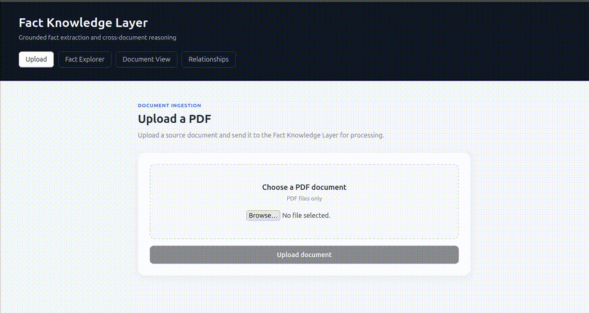

# Fact Knowledge Layer

A full-stack system that extracts structured, evidence-grounded facts from PDF documents, resolves entities across documents, and identifies cross-document relationships (corroboration, contradiction, reconciliation).

**Demo video:** https://youtu.be/CNV7ICs5Wns



---

## Table of Contents

1. [What it does](#what-it-does)
2. [Architecture](#architecture)
3. [Tech stack](#tech-stack)
4. [Prerequisites](#prerequisites)
5. [Setup and run](#setup-and-run)
6. [UI pages](#ui-pages)
7. [API reference](#api-reference)
8. [LLM providers](#llm-providers)
9. [Features built](#features-built)
10. [Known limitations](#known-limitations)
11. [Demo cases](#demo-cases)

---

## What it does

Upload any PDF → the system:

1. **Parses and chunks** the document into page-aware text segments
2. **Extracts structured facts** using an LLM — every fact includes entity, attribute, value, unit, time period, confidence, and an exact source quote
3. **Validates evidence** — facts without a verifiable quote in the source text are rejected
4. **Resolves entities** — "Delhivery", "Delhivery Ltd.", "Delhivery Limited" → same canonical entity
5. **Compares facts across documents** — finds corroborations, contradictions, and reconciliations
6. **Stores everything** in PostgreSQL with pgvector for future semantic search

---

## Architecture

```
PDF Upload
    ↓
FastAPI (REST API)
    ↓
Redis + Celery (background workers)
    ↓
PDF Parse → Chunking → LLM Extraction → Evidence Validation
    ↓
Entity Resolution → Fact Clustering → Cross-document Comparison
    ↓
PostgreSQL + pgvector (persistence)
    ↓
React / Vite (frontend)
```

### Backend structure

```
backend/app/
├── api/v1/
│   ├── routes_documents.py   — upload, list, delete, status, rerun
│   ├── routes_facts.py       — list, get, review (accept/reject)
│   ├── routes_relationships.py
│   ├── routes_compare.py     — selective comparison
│   ├── routes_entities.py    — entity explorer
│   ├── routes_analytics.py   — system-wide stats
│   ├── routes_jobs.py        — Celery job status
│   └── routes_schema.py      — fact type management
├── domain/
│   ├── models/               — Document, Chunk, Entity, Fact, Relationship
│   ├── services/             — ingestion, extraction, comparison, entity resolution
│   └── value_objects/        — EvidenceRef, TemporalScope
├── infra/
│   ├── db/                   — SQLAlchemy ORM, repositories, session
│   ├── llm/                  — LLM client (Ollama / Gemini / OpenAI)
│   ├── pdf/                  — PyMuPDF parser and chunker
│   ├── storage/              — blob storage
│   └── vectorstore/          — pgvector client
└── workers/
    ├── tasks_ingestion.py
    ├── tasks_extraction.py
    └── tasks_comparison.py
```

### Frontend structure

```
frontend/src/
├── pages/
│   ├── UploadPage.tsx        — PDF upload with live status polling
│   ├── StatusDashboard.tsx   — live processing dashboard
│   ├── AnalyticsPage.tsx     — charts and system overview
│   ├── FactExplorer.tsx      — search, filter, sort, export facts
│   ├── EntityExplorer.tsx    — browse entities and their facts
│   ├── ReviewQueue.tsx       — accept / reject flagged facts
│   ├── DocumentView.tsx      — per-document facts with evidence
│   ├── RelationshipGraph.tsx — cross-document relationships
│   └── ComparePage.tsx       — selective document comparison
├── components/
│   ├── FactCard.tsx
│   ├── EvidenceHighlighter.tsx
│   └── RelationshipBadge.tsx
└── api/client.ts             — typed API client (axios)
```

---

## Tech stack

| Layer | Technology |
|---|---|
| Frontend | React 19 + TypeScript + Vite |
| Backend API | FastAPI (Python 3.11+) |
| Background workers | Celery + Redis |
| Database | PostgreSQL 16 + pgvector |
| LLM (default) | Gemini 3.5-flash-lite (free tier) |
| LLM (alternative) | Ollama (local), OpenAI-compatible |
| PDF parsing | PyMuPDF |
| Migrations | Alembic |
| Containers | Docker Compose |

---

## Prerequisites

Make sure these are installed:

- **Python 3.11+**
- **Node.js 18+**
- **Docker Desktop** (for PostgreSQL + Redis)
- **Ollama** — only needed if using local LLM instead of Gemini

---

## Setup and run

### 1. Clone the repository

```bash
git clone https://github.com/Harsh-128/fact-knowledge-layer-submission.git
cd fact-knowledge-layer-submission
```

### 2. Start PostgreSQL and Redis

From the project root:

```bash
docker compose up -d
docker compose ps   # both should show "healthy"
```

### 3. Configure the backend

```bash
cd backend
cp .env.example .env
```

Open `backend/.env` and set your LLM provider. **Recommended — Gemini free tier (no credit card):**

```env
LLM_PROVIDER=gemini
GEMINI_API_KEY=your_key_here
GEMINI_MODEL=gemini-3.5-flash-lite
```

Get a free key at https://aistudio.google.com/apikey.

Alternatively use local Ollama:

```env
LLM_PROVIDER=ollama
OLLAMA_BASE_URL=http://127.0.0.1:11434
OLLAMA_MODEL=qwen2.5-coder:1.5b
```

### 4. Create the Python virtual environment

```bash
# Inside backend/
python -m venv .venv

# Windows
.venv\Scripts\activate

# Linux / macOS
source .venv/bin/activate

pip install -e ".[dev]"
```

### 5. Run database migrations

```bash
# Inside backend/ with venv activated
alembic upgrade head
```

This creates all tables and enables the pgvector extension.

### 6. Start Ollama (skip if using Gemini)

```bash
ollama pull qwen2.5-coder:1.5b
ollama serve
```

### 7. Start all services

Open **4 separate terminals**:

**Terminal 1 — FastAPI backend**

```bash
cd backend
.venv\Scripts\activate   # or source .venv/bin/activate
uvicorn app.main:app --reload
```

API available at `http://localhost:8000`  
Docs available at `http://localhost:8000/docs`

**Terminal 2 — Celery worker**

```bash
cd backend
.venv\Scripts\activate

# Windows — must use --pool=solo
celery -A app.workers.celery_app:celery_app worker --loglevel=info --pool=solo

# Linux / macOS
celery -A app.workers.celery_app:celery_app worker --loglevel=info
```

**Terminal 3 — Frontend**

```bash
cd frontend
npm install
npm run dev
```

Frontend available at `http://localhost:5173`

**Terminal 4 — Docker (already running from step 2)**

### 8. Open the app

```
http://localhost:5173
```

---

## Full services checklist

| Service | Command | Purpose |
|---|---|---|
| PostgreSQL + Redis | `docker compose up -d` | Database and message broker |
| FastAPI | `uvicorn app.main:app --reload` | REST API |
| Celery | `celery -A app.workers.celery_app:celery_app worker ...` | Background processing |
| Frontend | `npm run dev` | UI |
| Ollama | `ollama serve` | Local LLM (skip if using Gemini) |

---

## UI pages

| Page | Nav label | Description |
|---|---|---|
| Upload | Upload | Upload PDFs, track processing status |
| Status Dashboard | 📊 Status | Live cards for all documents — chunks, facts, review count |
| Analytics | 📈 Analytics | Charts: facts per doc, relationship types, confidence distribution, top entities |
| Fact Explorer | Fact Explorer | Search/filter/sort 600+ facts, export as CSV |
| Entity Explorer | 🏢 Entities | Browse canonical entities, see all facts per entity across documents |
| Review Queue | 🔍 Review | Accept or reject facts flagged as uncertain |
| Document View | Document View | Per-document fact list with evidence; delete documents |
| Relationships | Relationships | Cross-document relationships with LLM explanations; filter by doc/type |
| Compare | Compare | Select specific PDFs and compare only those |

---

## API reference

All endpoints are under `/api/v1/`.

### Documents

| Method | Path | Description |
|---|---|---|
| `GET` | `/documents` | List all documents |
| `POST` | `/documents/upload` | Upload a PDF (queues background job) |
| `DELETE` | `/documents/{id}` | Delete document + all facts/relationships |
| `GET` | `/documents/{id}/status` | Status with chunk/fact/review counts |
| `POST` | `/documents/{id}/rerun-comparisons` | Re-dispatch comparison tasks |

### Facts

| Method | Path | Description |
|---|---|---|
| `GET` | `/facts` | List facts (filter by doc, entity, attribute, needs_review, confidence) |
| `GET` | `/facts/{id}` | Get single fact with evidence |
| `PATCH` | `/facts/{id}/review` | Accept (`accept: true`) or reject (`accept: false`) a fact |

### Relationships

| Method | Path | Description |
|---|---|---|
| `GET` | `/relationships` | List relationships (filter by doc, type, fact_id) |
| `GET` | `/relationships/{id}` | Get single relationship with explanation |

### Entities

| Method | Path | Description |
|---|---|---|
| `GET` | `/entities` | List entities (search by name, filter by type) |
| `GET` | `/entities/{id}` | Entity detail — all facts grouped by attribute |

### Compare

| Method | Path | Description |
|---|---|---|
| `POST` | `/compare` | Compare specific documents: `{ "document_ids": ["id1", "id2"] }` |

### Analytics

| Method | Path | Description |
|---|---|---|
| `GET` | `/analytics/summary` | Full system stats — totals, charts data |

### Jobs

| Method | Path | Description |
|---|---|---|
| `GET` | `/jobs/{task_id}` | Celery task status |

---

## LLM providers

The system supports three providers, switchable via `.env`:

### Gemini (recommended — free tier)

```env
LLM_PROVIDER=gemini
GEMINI_API_KEY=your_key
GEMINI_MODEL=gemini-3.5-flash-lite
```

Free tier: 15 RPM, ~1000 RPD, no credit card. Get key at https://aistudio.google.com/apikey

### Ollama (local, no API key)

```env
LLM_PROVIDER=ollama
OLLAMA_BASE_URL=http://127.0.0.1:11434
OLLAMA_MODEL=qwen2.5-coder:1.5b
```

Requires Ollama installed and running. Slower but fully offline.

### OpenAI-compatible

```env
LLM_PROVIDER=openai
OPENAI_API_KEY=your_key
OPENAI_MODEL=gpt-4o-mini
OPENAI_BASE_URL=https://api.openai.com/v1
```

Also works with OpenRouter and other OpenAI-compatible providers.

---

## Features built

### Core pipeline
- PDF upload, parse, page-aware chunking
- LLM-based structured fact extraction with evidence validation
- Deterministic fast path for financial tables (no LLM call needed)
- Entity resolution across documents (normalises company name variants)
- Cross-document fact comparison → CORROBORATES / CONTRADICTS / RECONCILES
- SHA-256 duplicate detection (same PDF never processed twice)
- Asynchronous processing via Celery + Redis

### API
- Full REST API with 9 route groups
- Selective comparison endpoint (compare only chosen documents)
- Analytics endpoint (all stats in one call)
- Entity explorer endpoint with fact grouping
- Review workflow (accept/reject flagged facts)
- Re-run comparisons on demand

### Frontend (9 pages)
- Upload with live job status polling
- Status Dashboard — auto-polls every 3 s, progress bars
- Analytics — horizontal bar charts + donut charts (pure CSS/SVG, zero new packages)
- Fact Explorer — pagination, sort by confidence, min-confidence slider, CSV export
- Entity Explorer — search/filter entities, see all facts grouped by attribute
- Review Queue — accept / reject / undo with optimistic UI
- Document View — per-document facts, delete button, back navigation
- Relationship Explorer — filter by document and type, LLM explanations shown
- Compare page — checkbox selection, runs comparison only between selected PDFs

### Bug fixes (26 total from initial codebase)
- `TemporalScope` null construction corrupting every DB read
- Comparison pipeline completely unwired (relationships never created)
- Schema router never registered (all `/schema` endpoints 404)
- Temp upload files never cleaned up
- Auth permanently disabled (missing `api_key` field in Settings)
- Gemini model default was a non-existent model name
- PGVectorClient dimension hardcoded to 1536 (breaks with Ollama)
- setTimeout memory leak in upload polling loop
- Stale closure in Fact Explorer selected-fact logic
- pgvector extension not enabled before migrations
- And 16 more medium/low severity issues

---

## Known limitations

- **Scanned PDFs** (image-based) — no text layer, nothing extracted. OCR support (Tesseract) is planned.
- **Complex tables** — row/column relationships can break during PDF text extraction.
- **Gemini rate limits** — free tier allows ~15 RPM. Large documents (100+ pages) hit the limit and retry automatically, adding processing time.
- **Local Ollama** — much slower than Gemini for large documents (~40 sec/batch vs ~2 sec).
- **Temporal reasoning** — facts from different time periods with the same attribute can be hard to compare correctly.
- **Human review UI** — review metadata exists and the Review Queue page is functional, but there is no bulk-review workflow yet.

---

## Demo cases

### Case 1 — Corroborated fact

Two documents report the same underlying fact (possibly in different wording). The system extracts both, resolves to the same entity and attribute, and creates a `CORROBORATES` relationship.

### Case 2 — Genuine contradiction

Two documents report different values for the same entity, attribute, and time period. After numerical comparison the system creates a `CONTRADICTS` relationship and the LLM explains why.

### Case 3 — Apparent contradiction explained by context

Two values initially appear to conflict but are reconcilable — for example INR 100 crore vs INR 1000 million (same amount, different units), or the same metric reported for different quarters. The system creates a `RECONCILES` relationship with a full explanation.

### Case 4 — Extraction limitation

During testing with an unseen stock-report PDF, the extraction pipeline encountered a table whose numerical columns were not reliably mapped to their row headers. The extracted text values were meaningful but could not be unambiguously grounded to the correct row. This is documented as a known limitation of plain-text PDF chunking for complex tables.

---

## AI tools used

- **Gemini 3.5-flash-lite** (or Ollama `qwen2.5-coder:1.5b`) — fact extraction, entity comparison, relationship reasoning, explanation generation
- **Deterministic logic** — evidence validation, exact duplicate detection, table parsing, structural validation

The system deliberately keeps the LLM to semantic tasks only. Validation, persistence, deduplication, and exact comparisons are all deterministic.
